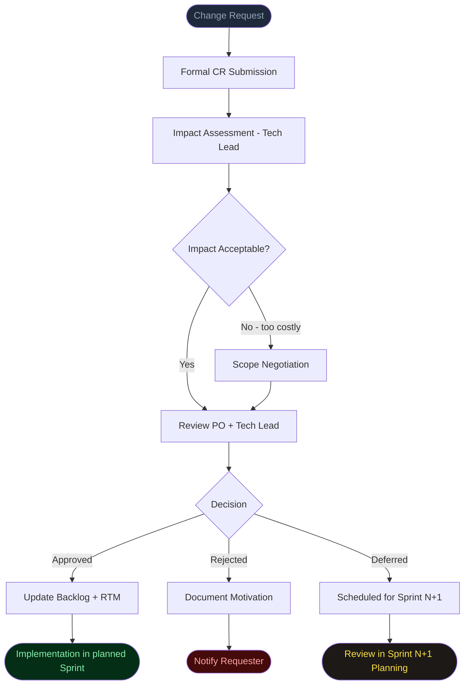
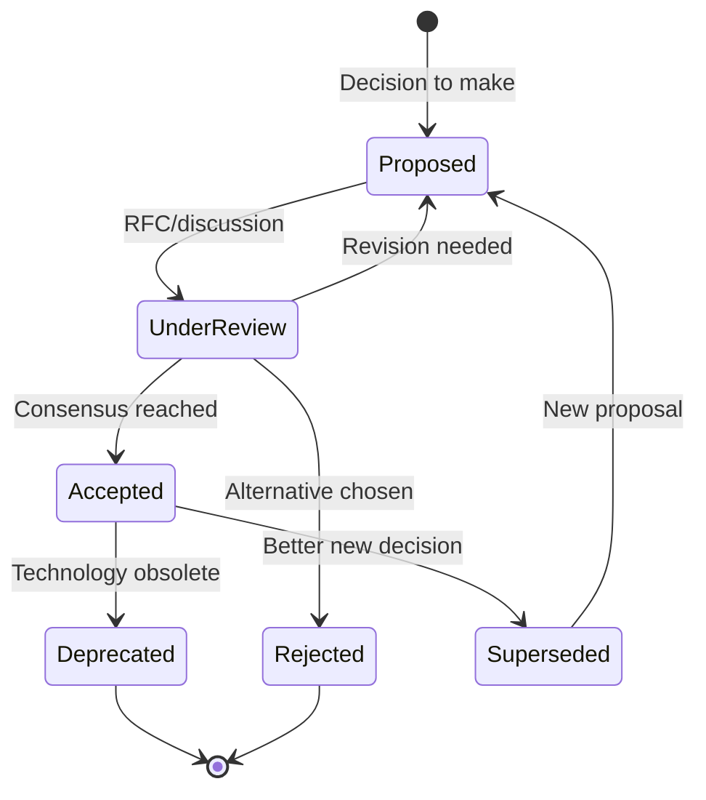
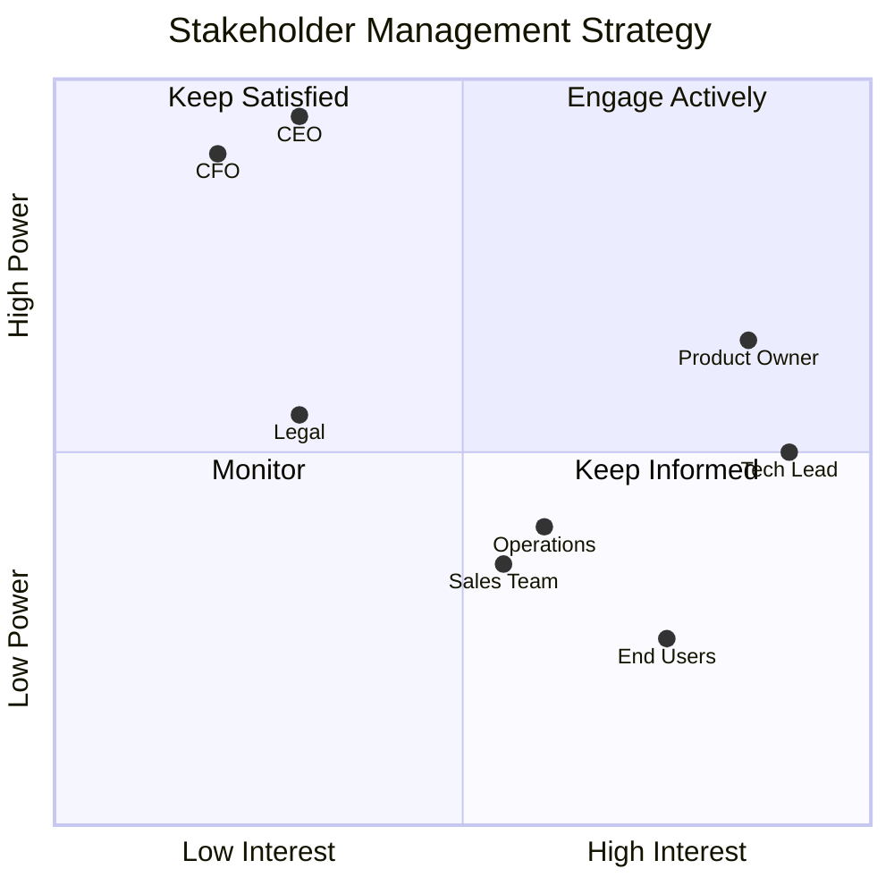
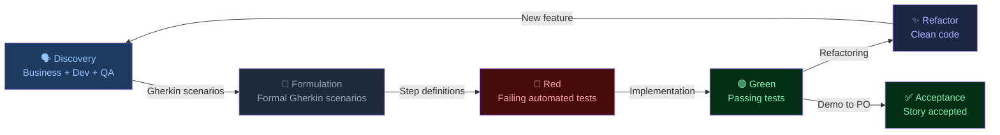

# SDSD Diagrams

This folder contains visual diagrams for the SDSD documentation.

## Available Files

### `sdsd-overview.svg`
**SDSD Framework Overview**

Visual map of the entire framework: at the center the developer and the project to be protected, surrounded by external threats (in red) and defensive shields (in green). Shows how each SDSD practice responds to a specific threat.

---

### `requirements-lifecycle.svg`
**Requirements Lifecycle**

Complete flow from elicitation to ongoing management, with the 5 main phases and the SDSD practices associated with each. The RTM bar at the bottom shows how traceability spans all phases.

---

### `antipatterns-radar.svg`
**Stakeholder Anti-Patterns Map**

Scatter diagram that positions the 12 cataloged anti-patterns on two axes: frequency (how often they occur) and potential damage (how much they impact the project). Useful for prioritizing countermeasures.

---

### `cost-of-defects.svg`
**Cost of Defect Correction by Phase**

Visualization of Barry Boehm's principle: the cost of correcting a defect grows exponentially with the delay in its detection. From 1x in the requirements phase to 100x in production.

---

## Mermaid Diagrams (for embedding in Markdown)

The following diagrams are in Mermaid format and can be rendered directly in GitHub, GitLab, Notion, and other tools that support Mermaid.

### Change Request Flow

---

### ADR Decision Flow

---

### Stakeholder Power/Interest Matrix

---

### BDD Cycle

---

### SDSD Defense Layers

```mermaid
graph TB
    subgraph L1["Layer 1: Prevention (Requirements)"]
        direction LR
        A[Structured elicitation]
        B[Formal sign-off]
        C[RTM]
        D[Glossary]
    end

    subgraph L2["Layer 2: Containment (Process)"]
        direction LR
        E[Change Request]
        F[Scope Baseline]
        G[DoD/DoR]
        H[Agile Ceremonies]
    end

    subgraph L3["Layer 3: Protection (Architecture)"]
        direction LR
        I[ADR]
        J[ACL - DDD]
        K[Feature Flags]
        L[Defensive Programming]
    end

    subgraph L4["Layer 4: Evidence (Tests)"]
        direction LR
        M[BDD/ATDD]
        N[Acceptance Tests]
        O[CI/CD]
        P[Metrics]
    end

    L1 --> L2
    L2 --> L3
    L3 --> L4

    style L1 fill:#052e16
    style L2 fill:#1c1917
    style L3 fill:#0c0a09
    style L4 fill:#0f172a
```

