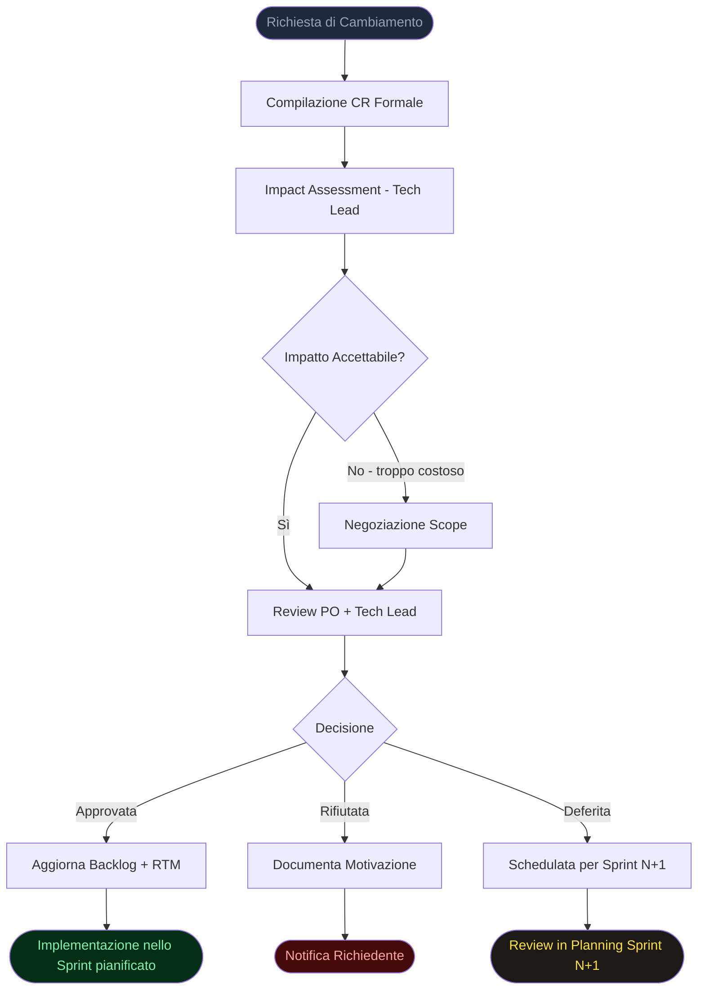
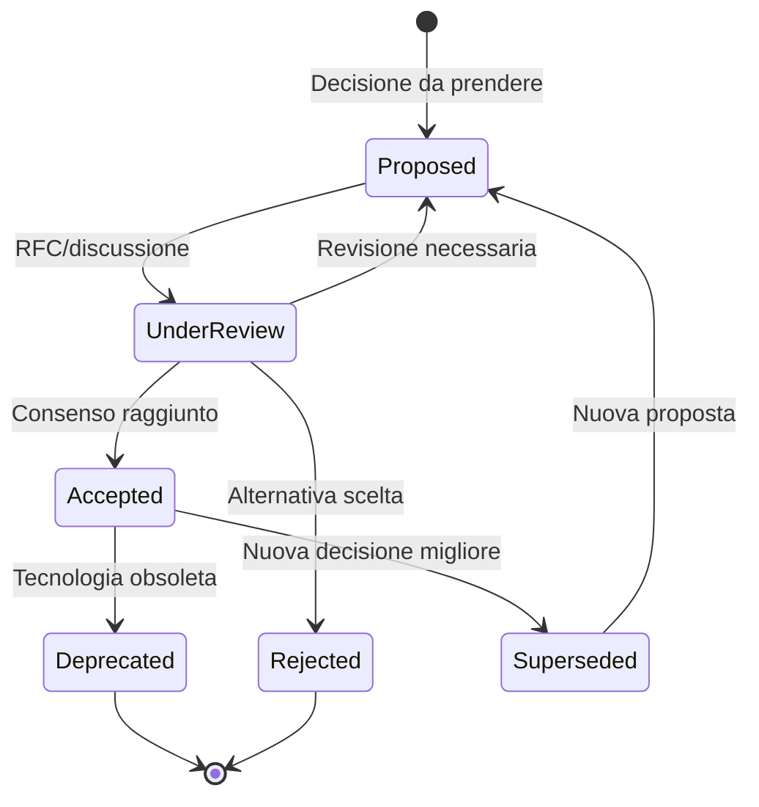
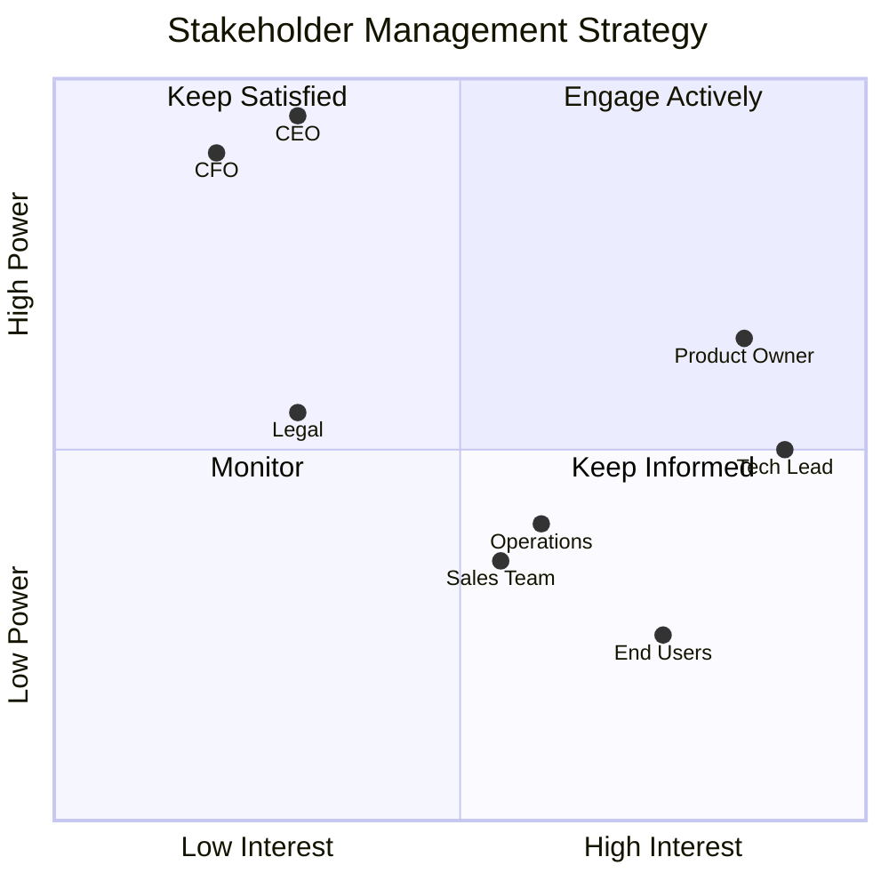
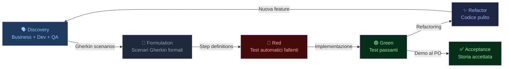

# Diagrammi SDSD

Questa cartella contiene i diagrammi visivi della documentazione SDSD.

## File Disponibili

### `sdsd-overview.svg`
**Panoramica del Framework SDSD**

Mappa visuale dell'intero framework: al centro il developer e il progetto da proteggere, circondati dalle minacce esterne (in rosso) e dagli scudi difensivi (in verde). Mostra come ogni pratica SDSD risponde a una minaccia specifica.

---

### `requirements-lifecycle.svg`
**Ciclo di Vita dei Requisiti**

Flusso completo dalla elicitazione alla gestione continua, con le 5 fasi principali e le pratiche SDSD associate a ciascuna. La barra RTM in fondo mostra come la traceability attraversa tutte le fasi.

---

### `antipatterns-radar.svg`
**Mappa degli Anti-Pattern degli Stakeholder**

Diagramma scatter che posiziona i 12 anti-pattern catalogati su due assi: frequenza (quanto spesso si verificano) e danno potenziale (quanto impattano il progetto). Utile per prioritizzare le contromisure.

---

### `cost-of-defects.svg`
**Costo di Correzione dei Difetti per Fase**

Visualizzazione del principio di Barry Boehm: il costo di correzione di un difetto cresce esponenzialmente con il ritardo nella sua rilevazione. Da 1x in fase di requirements a 100x in produzione.

---

## Diagrammi Mermaid (per embedding in Markdown)

I seguenti diagrammi sono in formato Mermaid e possono essere renderizzati direttamente in GitHub, GitLab, Notion, e altri strumenti che supportano Mermaid.

### Change Request Flow

---

### ADR Decision Flow

---

### Stakeholder Power/Interest Matrix

---

### BDD Cycle

---

### SDSD Defense Layers

```mermaid
graph TB
    subgraph L1["Layer 1: Prevenzione (Requisiti)"]
        direction LR
        A[Elicitazione strutturata]
        B[Sign-off formale]
        C[RTM]
        D[Glossario]
    end

    subgraph L2["Layer 2: Contenimento (Processo)"]
        direction LR
        E[Change Request]
        F[Scope Baseline]
        G[DoD/DoR]
        H[Agile Ceremonies]
    end

    subgraph L3["Layer 3: Protezione (Architettura)"]
        direction LR
        I[ADR]
        J[ACL - DDD]
        K[Feature Flags]
        L[Defensive Programming]
    end

    subgraph L4["Layer 4: Evidenza (Test)"]
        direction LR
        M[BDD/ATDD]
        N[Acceptance Tests]
        O[CI/CD]
        P[Metrics]
    end

    L1 --> L2
    L2 --> L3
    L3 --> L4

    style L1 fill:#052e16
    style L2 fill:#1c1917
    style L3 fill:#0c0a09
    style L4 fill:#0f172a
```

